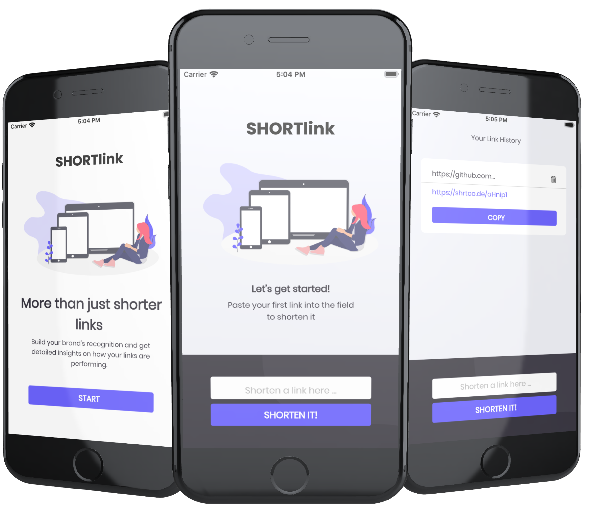

# Flutter - SHORTlink

<h1 align="center">
  
</h1>

Basically, we have 3 flows in this application:
1. Shorten any valid URL.
2. See a list of their shortened links.
3. Delete or copy a shortened link from their link history.

## Author

#### Renata Oliveira
[](https://www.linkedin.com/in/renatafariaoliveira/)


## Requirements

This project was built using Flutter SDK [2.2.1] and Dart [2.13.1].

* Any Operating System (ie. MacOS X, Linux, Windows)
* Any IDE with Flutter SDK installed (ie. Android Studio, VSCode, IntelliJ, etc)
* A little knowledge of Dart and Flutter

_Tip: For help getting started with Flutter, view
[online documentation](https://flutter.dev/docs)._

## Get Started

Important: You need to set up your dev environment previously.

1. Clone this repository to your machine.
1. Open console and got to the root project.
2. Run this coomands in order:

 ```flutter pub get```

 ```flutter run```

## Libs & Packages

**_dependencies_**
* [dartz](https://pub.dev/packages/dartz): Functional programming in Dart.
* [flutter_modular](https://pub.dev/packages/flutter_modular): Dependency injection, routing system and so on.
* [bloc](https://pub.dev/packages/bloc): Implement the BLOC pattern.
* [carousel_slider](https://pub.dev/packages/carousel_slider): A carousel slider widget.
* [google_fonts](https://pub.dev/packages/google_fonts): Allows you to easily use any of the 977 fonts to your app.
* [flutter_svg](https://pub.dev/packages/flutter_svg): Draw SVG files on a Flutter Widget.
* [flutter_screenutil](https://pub.dev/packages/flutter_screenutil): A flutter plugin for adapting screen and font size.
* [dio](https://pub.dev/packages/dio): A powerful Http client for Dart, which supports Interceptors, Global configuration, FormData, Request Cancellation, File downloading, Timeout etc.


**_dev dependencies_**
* [mockito](https://pub.dev/packages/mockito): Mock library for Dart.
* [build_runner](https://pub.dev/packages/build_runner): The build_runner package provides a concrete way of generating files using Dart code, outside of tools like pub.

## Screenshots

<h1 align="center">
  
  
  
  
</h1>

## API Response Example
### SUCCESS

```
{
    "ok": true,
    "result": {
        "code": "kq5546",
        "short_link": "shrtco.de/kq5546",
        "full_short_link": "https://shrtco.de/kq5546",
        "short_link2": "9qr.de/kq5546",
        "full_short_link2": "https://9qr.de/kq5546",
        "short_link3": "shiny.link/kq5546",
        "full_short_link3": "https://shiny.link/kq5546",
        "share_link": "shrtco.de/share/kq5546",
        "full_share_link": "https://shrtco.de/share/kq5546",
        "original_link": "https://flutter.dev/docs/get-started/install/macos"
    }
}
```

### ERROR

```
{
    "ok": false,
    "error_code": 2,
    "error": "This is not a valid URL, for more infos see shrtco.de/docs"
}
```

## Unit Tests

Currently, it has a unit tests for some layers.